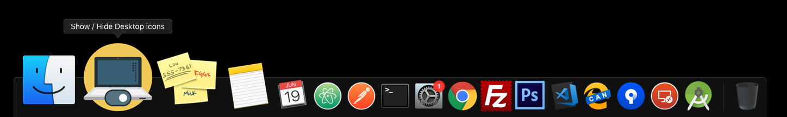

Instantly Show or Hide Desktop Icons on your MAC
=====


This is a simple Automator app written is shell script that toggles the visibility of desktop icons in macOS.

All you have to do is, download the app and extract the zip file. 

After extracting the downloaded file, **drag the "Show / Hide Desktop Icons" app to your Dock** and you are done. Simple right? 



Whenever you wish to hide the desktop icons, just click on the app icon in Dock and your desktop icons will disappear instantly. Don't worry you can access them normally from Finder.

To bring back desktop icons again, click the "Show / Hide Desktop Icons" app in Dock once again and BHOOM! They reappear as magic ;) 

<a href="https://github.com/amarilindra/Show-Hide-Mac-Desktop-Icons/raw/master/Show%20:%20Hide%20Desktop%20Icons.app.zip"></a>

Under the hood
====

This app first checks the status of ```com.apple.finder CreateDesktop default```. If it returns ```true```, then the desktop icons are hidden with the command 

```defaults write com.apple.finder CreateDesktop false```

and if it returns ```false```, desktop icons are set to visible by running the command 

```defaults write com.apple.finder CreateDesktop true```

And every time Finder is restarted with the command ```killall Finder```

Useful Links
====

[Blog post][2]

[Shell script][1]

[Download App][3]


[1]: https://github.com/amarilindra/Show-Hide-Mac-Desktop-Icons/blob/master/script.sh
[2]: https://www.geekdashboard.com/show-hide-desktop-icons-on-mac/
[3]: https://github.com/amarilindra/Show-Hide-Mac-Desktop-Icons/raw/master/Show%20:%20Hide%20Desktop%20Icons.app.zip

<a href="https://www.producthunt.com/posts/show-hide-desktop-icons?utm_source=badge-featured&utm_medium=badge&utm_souce=badge-show-hide-desktop-icons" target="_blank"></a>
